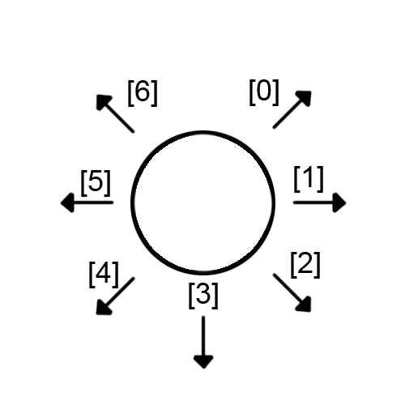
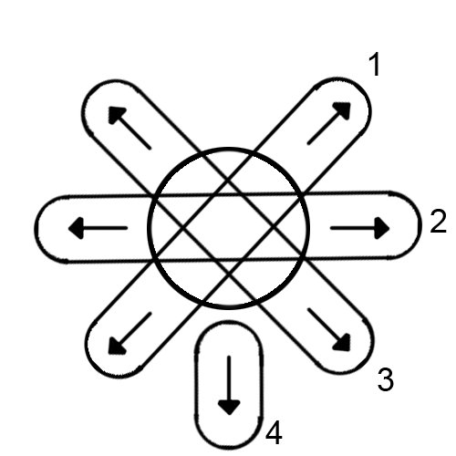
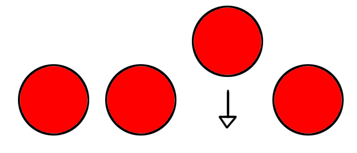

## X en Linea 

### Documentación

#### Algoritmo de detección de lineas dinámico:

##### Introducción
Al arrancarlo a plantear desde un punto de vista recursivo, la responsabilidad caerá en la ficha.
Cada ficha sabe sus vecinos inmediatos en base a un array, y cada vez que se crea o se agrega una ficha nueva al tablero
se recalcularán los vecinos de CADA ficha, para mantener consistencia.

Para saber la dirección o posición de un vecino respecto a mí, se toma como indicador la posición del vecino en el array.
Por ejemplo:

Por lo tanto, la pos 0 del array sería el vecino en la esquina derecha - arriba.

##### Funcionamiento
En base a la ultima ficha colocada, se le pide a todos los vecinos de esa ficha que busquen recursivamente en su misma dirección, fichas con el mismo dueño que la ficha base y sumándolas.
Una vez que se retorna la cantidad de fichas por las que pasó en esa dirección, se calcula si ese numero es el límite del juego.
Si no lo es, se busca en exactamente la dirección opuesta, repitiendo el proceso.
Si en la dirección opuesta tampoco se llega, se suman las fichas de las 2 direcciones, y si tampoco se llega, se repite el proceso hasta que se encuentre una linea compatible.
En caso de que no se encuentre, se seguirá jugando.

En la imagen se puede ver como el algoritmo realiza el recorrido de a pares.

De esta manera, se pueden evitar casos especiales en donde la ultima ficha colocada, se ubique justo en el medio de la linea.

